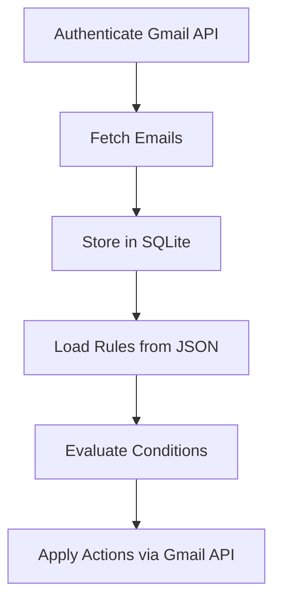

# 📧 Gmail Automation with Rule-Based Processing

---

## 📌 Overview
This project is a **standalone Python application** that integrates with the **Gmail API** to automate email management. It:
- Fetches emails from your Gmail inbox.
- Stores them in a local SQLite database.
- Applies **custom rule-based actions** such as marking emails read/unread or moving them to specific labels.

The solution is modular, easy to configure, and includes unit tests for reliability.

---

## ✨ Features
- **Gmail API Integration** using OAuth 2.0.
- **Rule Engine** powered by JSON configuration.
- Supported actions:
  - ✅ Mark as read/unread.
  - ✅ Move email to a label (creates label if missing).
- **SQLite Database** for storing fetched emails.
- **Unit & Integration Tests** using `pytest`.

---

## 📂 Project Structure
```
gmail_automation/
├── auth.py                # Handles Gmail API OAuth authentication
├── db.py                  # SQLite wrapper for storing emails
├── fetch_emails.py        # Fetches emails and stores them in DB
├── process_rules.py       # Applies rules and actions via Gmail API
├── rules.json             # Configurable rules for email processing
├── requirements.txt       # Python dependencies
└── tests/                 # Unit and integration tests
    ├── test_predicates.py
    ├── test_conditions.py
    ├── test_actions.py
    └── test_rule_engine.py
```

---

## ✅ Prerequisites
- Python **3.10+**
- Gmail API enabled in [Google Cloud Console](https://console.cloud.google.com/).
- OAuth 2.0 credentials (`credentials.json`).

---

## 🔧 Installation
Clone the repository and install dependencies:
```bash
git clone <repo-url>
cd gmail_automation
pip install -r requirements.txt
```

---

## 🔐 Gmail API Setup
1. Enable Gmail API in [Google Cloud Console](https://console.cloud.google.com/).
2. Create **OAuth 2.0 Client ID** (Desktop app).(https://youtu.be/1Ua0Eplg75M?si=hb4-Z6mLpLpw8t06)
3. Download `credentials.json` and place it in the project root.
4. First run will prompt browser login and create `token.json`.

> **Important:** Add `credentials.json` and `token.json` to `.gitignore` before pushing to GitHub.

---

## ▶️ How to Run
### **Step 1: Fetch Emails**
```bash
python fetch_emails.py
```
- This will authenticate via Gmail API and store emails in `emails.db`. It will fetch first 5 mails in the inbox.

### **Step 2: Apply Rules**
```bash
python process_rules.py
```
- Reads `rules.json` and applies actions to matching emails.

---

## 📜 Rules Configuration
Define your rules in `rules.json`:
```json
{
  "rules": [
    {
      "id": "assignment_rule",
      "description": "Identify assignment emails and mark as unread",
      "collection_predicate": "all",
      "conditions": [
        {"field": "from_email", "predicate": "contains", "value": "kruthikbv4@gmail.com"},
        {"field": "subject", "predicate": "contains", "value": "assignment"},
        {"field": "message", "predicate": "contains", "value": "please finish"}
      ],
      "actions": ["mark_unread", "move_message:HAPPYFOX_ASSIGNMENT"]
    }
  ]
}
```

### **Supported Fields**
- `from_email`, `subject`, `message`, `received_datetime`

### **Predicates**
- String: `contains`, `not_contains`, `equals`, `not_equals`
- Date: `older_than_days`, `newer_than_days`

### **Actions**
- `mark_read`
- `mark_unread`
- `move_message:<LabelName>`
- `move_message_keep_inbox:<LabelName>`

---

## ✅ Tests
Run all tests:
```bash
pytest tests/
```
Includes:
- Predicate evaluation (`test_predicates.py`)
- Condition checks (`test_conditions.py`)
- Action execution (`test_actions.py`)
- Rule engine integration (`test_rule_engine.py`)

---

## 📈 Workflow Diagram


---

## 🎥 Video Tutorial
[Watch here for generating credentials.json file](https://youtu.be/1Ua0Eplg75M?si=hb4-Z6mLpLpw8t06)

---


### ✅ Notes
- Ensure `rules.json` has a top-level `"rules"` key.
- Normalize `date_received` for accurate date-based predicates.
- Add `.gitignore` for sensitive files before pushing to GitHub.

---
